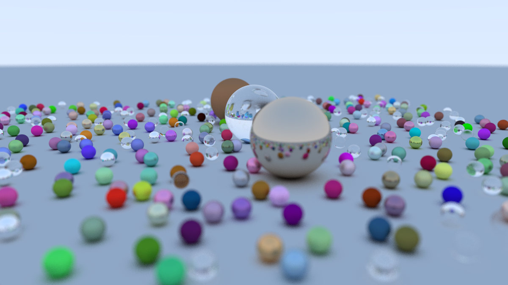

# Rust-Tracer

Implementing basic path-tracer following 
[Peter Shirley "Ray Tracing in One Weekend"](https://raytracing.github.io/books/RayTracingInOneWeekend.html) 
book.

Also check out <https://raytracing.github.io/>

## Results

